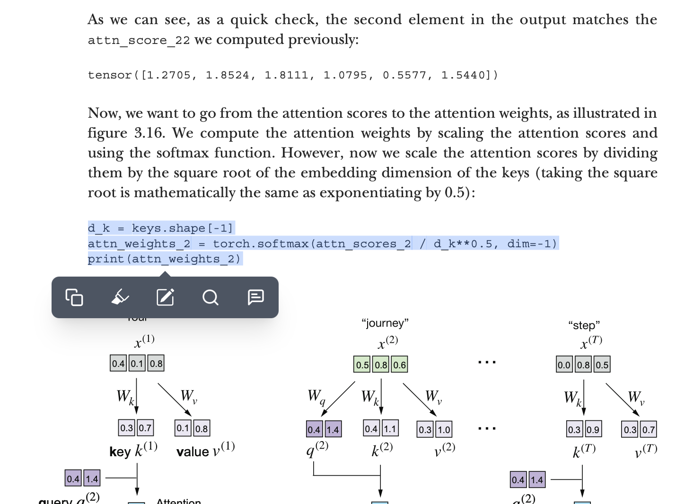
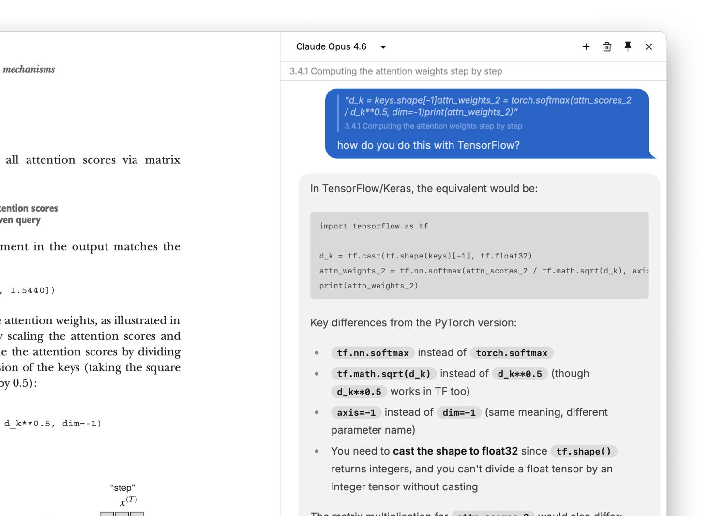

<p align="center">
  
</p>

# Marginalia

A desktop ebook reader with a built-in AI companion.

> _Marginalia (n.) — notes, comments, and annotations made in the margins of a book; from Latin marginalis, "of the margin."_

I built this to aid in reading technical books, where I find I constantly wish to stop and ask questions about the material. Inspired by Andrej Karpathy's [reader3](https://github.com/karpathy/reader3). Select a passage, ask a question, and have an ongoing conversation about it without leaving the page.

<p align="center">
  
</p>

<table>
  <tr>
    <td></td>
    <td></td>
  </tr>
</table>

## What it does

Marginalia combines a slimmed-down fork of [Readest](https://github.com/readest/readest) (an open-source ebook reader) with [Pi](https://github.com/badlogic/pi-mono) (an AI agent framework) into a single desktop app. Read on the left, chat on the right. The AI knows what book you're reading, what chapter you're in, and has the full chapter text as context.

## Features

Reading:

- EPUB, PDF, MOBI, AZW/AZW3, FB2, CBZ, TXT, Markdown
- Page and scroll mode
- Highlights, bookmarks, annotations
- Export annotations as Markdown
- Full-text search
- Dark/light/auto theme
- Customizable fonts, margins, layout

AI chat:

- Collapsible sidebar panel
- Select text, click "Ask AI" to discuss it
- Full chapter text included as context
- Multiple conversations per book, persisted across sessions
- Claude Opus 4.6, Claude Sonnet 4.6 (via Claude Code Max)
- GPT-5.4 (via Codex CLI)
- Auto-loads auth tokens from Claude Code and Codex CLI

## How it works

The app piggybacks on your existing Claude Code and Codex CLI credentials — no separate API keys needed. Open a book, open the chat panel, and start asking questions.

Credentials are loaded from:

- **Claude Code** — macOS Keychain (service `Claude Code-credentials`)
- **Codex CLI** — `~/.codex/auth.json`

If you get a 401, make sure you've authenticated first (`claude auth login` / `codex auth`).

## Installation

### Homebrew (Recommended)

```bash
brew install eddmann/tap/marginalia
```

### Manual Download

Download the latest release from [GitHub Releases](https://github.com/eddmann/Marginalia/releases):

- **macOS:** `.dmg` (Apple Silicon and Intel)
- **Linux:** `.AppImage` or `.deb`

## Development

Requires Rust, Node.js 20+, and pnpm.

```
make install   # Install all dependencies
make dev       # Start development server
make build     # Build production app
make lint      # Run all linting
make fmt       # Format all code
make clean     # Remove all build artifacts
```

## Built with

- [Readest](https://github.com/readest/readest) — ebook reader
- [Pi](https://github.com/badlogic/pi-mono) — AI agent framework
- [Tauri v2](https://tauri.app) — native desktop runtime

## License

AGPL-3.0 — same as [Readest](https://github.com/readest/readest), from which this project is forked.
